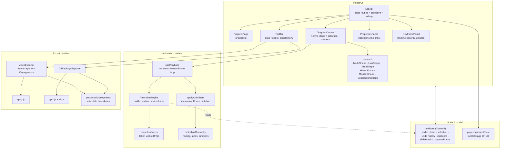
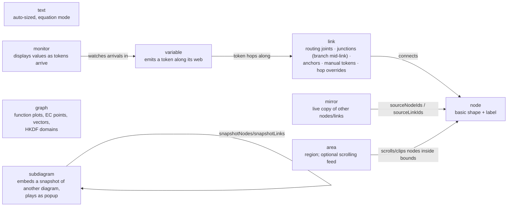
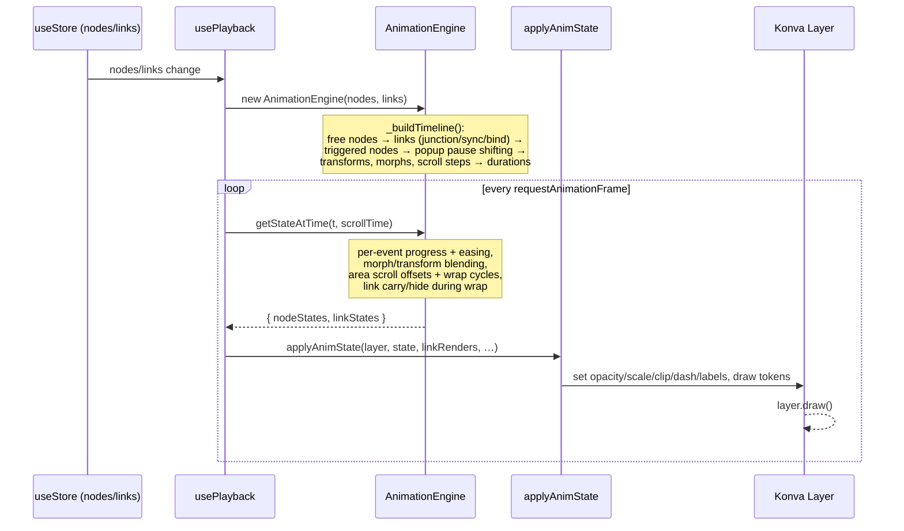
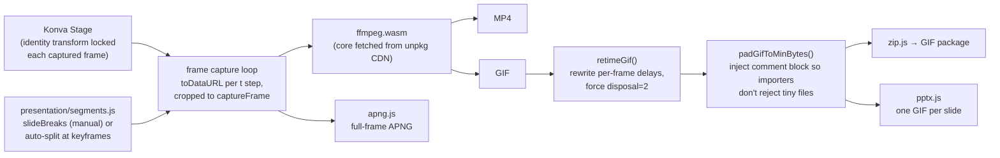
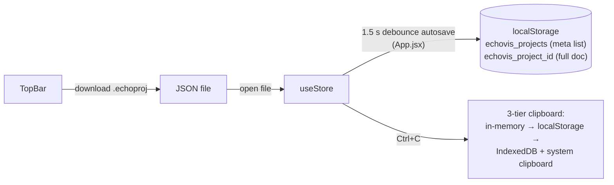

# ECHO-VIS — Codebase Analysis

> Generated 2026-06-12. Covers architecture, data flow, and a review of bugs, performance and hygiene issues.

ECHO-VIS is a **browser-based animated diagram editor**: you draw nodes and links on a Konva canvas, give every element a position on a timeline (keyframes, triggers, token flows, popups, transforms), preview the animation in real time, and export the result as MP4 / GIF / APNG / PPTX. It is clearly built for explaining protocols (crypto flows, double-ratchet feeds, HKDF domains show up in the defaults).

**Stack:** React 18 + Vite 5 · Konva / react-konva (canvas) · Zustand (state) · ffmpeg.wasm (video encode) · uuid. No backend — persistence is `localStorage`, exports run entirely client-side.

---

## 1. High-level architecture



---

## 2. The data model

Everything is two flat arrays in the Zustand store: `nodes[]` and `links[]`. A "node" is really a tagged union — eight types share one schema (`type` field), each with its own defaults block in `useStore.js`:



Key link concepts:

- **Joints** — waypoints that bend a link; a joint can be a **junction** that other links branch from (`fromJunctionLinkId`/`fromJunctionJointId`), with optional synchronized sibling animation (`syncBranches`).
- **Variable webs** (`variables/flow.js`) — BFS from each `variable` node over outgoing links produces an ordered hop path. Each hop starts only after the upstream hop lands *and* the link has finished drawing. Per-link and per-variable overrides (`tokenHopDuration`, `tokenHopDelay`, `tokenHopSkip`, `tokenHopOverrides`) tune timing; `tokenKillFor` stops a token at a node.
- **Manual tokens** — a per-link token independent of variables, with its own keyframed text and replay behavior inside scrolling areas.

---

## 3. Animation pipeline (the core of the app)

Timing is computed declaratively, rendering is applied imperatively. React only re-renders for UI chrome (~30 fps throttled); the canvas itself is mutated directly at 60 fps.



Notable design points:

- **Two clocks.** `playbackTime` (unwrapped, keeps finished animations at their final state) vs `currentTime` (display, wraps when a seamless scrolling area forces loop playback). This is what lets an endless message feed loop while one-shot entry animations stay completed.
- **Scheduling with pauses.** Subdiagram popups insert "pause windows"; later events are shifted past `popupEnd` so the popup plays out before the diagram continues. The scheduler is an earliest-start greedy loop with trigger-dependency resolution (`getCandidateStart`).
- **Trigger chaining.** A node can start relative to a link finishing (`triggerAfterLinkId`, `triggerMode: overlap|on-end`, `triggerDelay`), and a link can *bind* its draw animation to a variable token hop (`bindToTokenHop`).
- **Resilience.** Both the RAF loop and the scrub path wrap frame application in try/catch so one bad frame can't kill playback — with once-only error logging.

---

## 4. Export pipeline



The presentation flow is the most distinctive part: `collectPresentationSegments` slices the timeline at every "something happens" moment (or at manual `slideBreaks`), exports one GIF per segment, and assembles a PPTX deck where each slide plays its segment — so a presenter steps through the protocol one event at a time.

A lot of low-level care lives here: hand-rolled GIF block parsing (`inspectGif`), per-frame delay rewriting to hit exact wall-clock duration, disposal-method forcing for slide-importer compatibility, and comment-block padding because some importers reject very small GIF files.

---

## 5. Persistence



---

## 6. Findings — bugs, mistakes, improvements

> **Implementation status (2026-06-12):** every actionable item below has been applied —
> repo hygiene (1–3), all bugs (4–10), the performance fixes (11–13: Map lookups,
> throttled drag writes, deduped/memoized derivations), the helper extraction (18),
> the `colorThemes` move (19), dead-weight removal including the whole Google
> integration (20), canvas-measured text sizing (21), and a Vitest suite (17:
> 30 tests over `AnimationEngine`, `flow.js`, `segments.js`, and the extracted
> `gifBytes.js`). Items 14–15 are documented trade-offs (no action required).
> The one deliberate deferral is the **panel split in 16**: a behavior-neutral
> refactor of two 3.4k-line UI components is high regression risk to do blind —
> it should be done incrementally with the app running, now that the test
> foundation exists. `testProjects/` and `TopRightPPTX/` were left in place
> (user content; delete manually if they're scratch).

### 🔴 Critical / repo hygiene

| # | Finding |
|---|---------|
| 1 | **`node_modules/` is committed to git** (the 2 814 tracked files are mostly dependencies), along with **`dist/`** build output. `.gitignore` contains only `.claude`. This bloats the repo, makes every dependency update a giant diff, and will eventually cause merge pain. |
| 2 | **`.env` is committed.** The whole point of `.env.example` (which exists) is that `.env` stays untracked — untrack and delete it. |
| 3 | `package.json` says `0.1.0` while the git history says "chore: bump to v2.0.0" — version drift. |

Fix for 1–2:

```gitignore
# .gitignore
node_modules/
dist/
.env
.claude/
```

then `git rm -r --cached node_modules dist .env` and commit.

### 🟠 Bugs

4. **Paste breaks mirror references** (`useStore.js` → `pasteClipboard`). Link IDs get a pre-pass (`linkIdMap` filled before remapping), but node IDs are assigned *inside* the `clipboard.nodes.map(...)` as it iterates. A mirror node that appears in the array **before** its source nodes sees an incomplete `idMap`, so its `sourceNodeIds` / `mirrorNodeOverrides` keep pointing at the *original* nodes instead of the pasted copies. Fix: assign all node UUIDs in a first pass, then build the new nodes.

5. **Most inspector edits are not undoable.** `updateNode`, `updateLink`, `updateLinkJoint`, `updateMonitorWatch`, `updateMirror*Override` never call `_pushHistory`, and `PropertiesPanel.jsx` (the main consumer) never pushes either — `_pushHistory` appears only in `useStore` itself and `KeyframePanel`. So Ctrl+Z undoes canvas and timeline edits but silently skips color/label/size/behavior changes. If skipping per-keystroke history is intentional, push one snapshot on focus/commit instead.

6. **Loaded links are never normalized.** `loadProjectData` runs every node through `normalizeNode(...)` but passes `links` straight through. Old `.echoproj` files (or hand-edited ones) missing newer fields (`tokenHopOverrides`, `manualTokenTextKeyframes`, …) rely on scattered `?? `fallbacks across the codebase; one missed fallback is a runtime crash. Merge `{ ...LINK_DEFAULTS, ...link }` on load, mirroring what nodes get.

7. **Deleting leaves dangling references.** `removeNode`/`deleteSelected` clean up links, but nothing clears other nodes' `triggerAfterLinkId` (when its link dies), `transformTargetNodeId`, monitor `variableNodeId`/`monitorWatches[].nodeId`, or mirror `sourceNodeIds`. Lookups tolerate the misses (`?.`, `find` returning undefined), but behavior degrades silently — e.g. a triggered node falls back to default scheduling with no indication why.

8. **`capturePreview.js` is dead code → project thumbnails never exist.** Nothing calls `capturePreview`, and `writeProject` sets `meta.preview = full.preview ?? null`, with no caller ever passing `preview`. Either wire it up (call it in the autosave path / on go-home and store the data-URL) or delete the file.

9. **Autosave can silently lose data on quota.** `projectStore.writeProject` calls `localStorage.setItem` with no try/catch. Projects embed full subdiagram snapshots, so big documents can exceed the ~5 MB quota; the debounced autosave in `App.jsx` would then throw uncaught on every edit, and the user only finds out after reopening. The clipboard code already handles quota — project saves should too (catch + surface a "save failed" indicator, or move project storage to IndexedDB, which already exists in the codebase for the clipboard).

10. **CDN runtime dependency for export.** `VideoExporter.getFFmpeg()` fetches `@ffmpeg/core` from `unpkg.com` at export time. No network (classroom demo!) or an unpkg outage = exports break; it's also a supply-chain exposure since the wasm isn't integrity-checked. The package is already in `node_modules` — serve it as a local Vite asset. Also, if `load()` fails halfway, `ffmpegInstance` stays assigned while `ffmpegReady` is false, leaking a half-initialized instance on retry.

### 🟡 Performance

11. **Per-frame `Array.find` inside the hot loop.** `AnimationEngine.getStateAtTime` runs every RAF frame and does `this.nodes.find(...)` / `this.links.find(...)` *inside* the per-event loop → O(events × elements) per frame, 60×/s. Build `Map` lookups once in the constructor (`_buildTimeline` has the same pattern in several loops). This is the cheapest big win for large diagrams.

12. **Dragging rebuilds the world on every mousemove.** `NodeShape.handleDragMove` calls `updateNode(id, {x, y})` per pointer event → the `nodes` array is replaced → `usePlayback`'s `useMemo`s rebuild `AnimationEngine` (including a **nested engine per subdiagram** for popup metrics), `computeLinkRenders` (full link-geometry pass), `computeVariableWebs` and `buildMirrorBindings` — all per mousemove. Konva already shows the dragged position imperatively (`applyDraggedPosition`); commit to the store on `dragEnd` only (links need a redraw during drag, but that can come from a lightweight position-override path rather than a full engine rebuild), or at minimum throttle the store write.

13. **Duplicate work per rebuild.** `computeVariableWebs` runs twice per change (inside `_buildTimeline` for hop binding, again in `usePlayback`), and `computeManualTokenTimingByLinkId` is recomputed on every render of `usePlayback` without memoization (the comment cites Fast Refresh hook order — wrapping it in `useMemo` unconditionally would not change hook order).

14. **History snapshots deep-copy everything.** `_pushHistory` clones all nodes (with nested arrays/objects) and links on every undoable action, up to 60 deep. Fine for small diagrams; for big ones consider patch-based history (e.g. zustand + immer patches) — it would also make point 5 cheap to fix properly.

15. **Quadratic scheduler.** The `while (pendingEvents.length)` loop in `_buildTimeline` scans all pending events each iteration (O(n²)), plus `collectDescendantLinkIds` re-scans all links per BFS step. Irrelevant below ~hundreds of elements, but worth knowing where the wall is.

### 🟢 Maintainability / structure

16. **Monster components.** `PropertiesPanel.jsx` (3 492 lines), `KeyframePanel.jsx` (3 305), `NodeShape.jsx` (1 621), `DiagramCanvas.jsx` (1 567). The properties panel is naturally splittable by node type (one sub-panel per `type`), the keyframe panel by track type. This is the single biggest readability cost in the repo.

17. **No tests, no linter config.** There is an `eslint-disable` comment but no ESLint config in the repo. The most valuable modules to test are pure and dependency-free: `AnimationEngine` (scheduling invariants — pause shifting and trigger chaining are subtle and clearly bug-prone), `variables/flow.js`, `presentation/segments.js`, `links/linkGeometry.js`, and the GIF byte-twiddling in `VideoExporter` (`inspectGif`/`retimeGif` would catch regressions instantly with fixture bytes). Vitest drops into this Vite setup with zero config.

18. **Duplicated bind-to-hop logic.** The "choose the hop candidate for a bound link" block (filter by `bindVariableId`, else earliest start, apply offset/scale) is copy-pasted between `_buildTimeline` and `getStateAtTime`. Extract one helper.

19. **`colorThemes.js` lives at the repo root** and is imported as `../../colorThemes` from `src/`. Move it into `src/` with the rest of the source.

20. **Leftover dead weight:** `vectorSequential` ("legacy (no-op)"), `// ECC demo removed` and `// Google auth removed` comments, and `testProjects/` + `TopRightPPTX/` screenshot folders that look like scratch artifacts. Since the direct-to-Google-Slides path is out of scope, the whole `integrations/google/` folder, `GoogleSlidesGifExporter.js`, `GoogleSlidesVideoExporter.js`, `oauth-callback.html`, their TopBar menu entries, and the `VITE_GOOGLE_CLIENT_ID` env var can be deleted with them.

21. **Text sizing is heuristic.** `getTextNodeSize` estimates width as `chars × fontSize × 0.62` — wide glyphs/non-Latin text will overflow. Konva can measure text exactly (`Konva.Text.measureSize` or an offscreen canvas `measureText`); worth it since auto-size feeds the saved node geometry.

### Suggested priority

1. Fix `.gitignore` + untrack `node_modules`/`dist`/`.env` (5 minutes, biggest hygiene payoff).
2. Map-based lookups in `AnimationEngine` + commit-on-dragEnd (the two real performance items).
3. Quota-safe project saves (data-loss risk).
4. Normalize links on load + paste mirror remap (correctness).
5. Decide the undo story for the properties panel.
6. Vendor ffmpeg core locally.
7. Add Vitest and start with `AnimationEngine`/`flow.js`/`segments.js` tests, then split the two giant panels.
