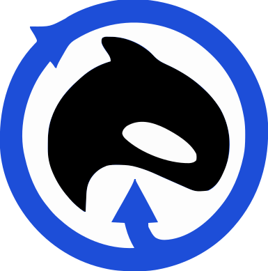

<p align="center">
  &nbsp;&nbsp;
  <big><big><big><strong>ECHO-VIS</strong></big></big></big>
</p>

---

## Features

- Draw nodes and connect them with links that route around each other
- Bend links through waypoints, or branch them off mid-link
- Control exactly where a link meets a node — side, offset, or a fixed anchor point
- Set when each element appears and how long it takes, or let them sequence automatically
- Export the whole thing as a video

## Getting started

```bash
npm install
npm run dev
```
